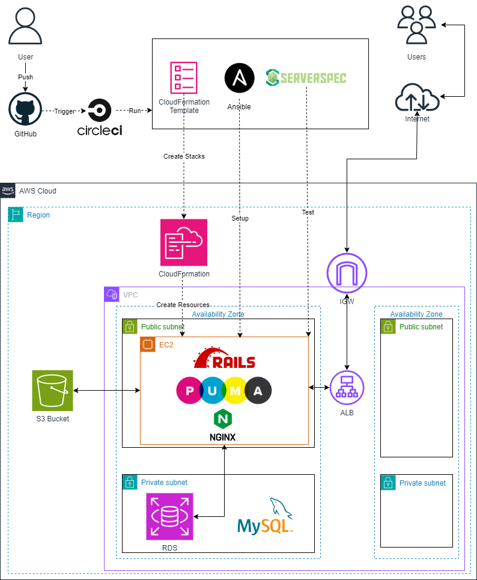

# Railsアプリケーションを稼働させるインフラストラクチャーを自動構築

## 実施概要

CRUD処理が出来る簡単なRailsアプリケーションを稼働させるインフラストラクチャーを自動構築した。  



[作成したコードはこちらのリポジトリからご確認ください](https://github.com/s-nakaji03/lecture13-CircleCI.ansible)

使用ツールは下記の通り。

**CircleCI**  

- AWS CLI経由でcloudformationを作成
- Ansibleを実行
- ServerSpecを実行

**CloudFormation** 

- VPC、EC2、RDS、ALB、S3を作成
- S3へのアクセスを許可するIAMロールをEC2に付与

**Ansible**

- Railsアプリケーションを実行するための環境構築を行う設定を記述
- Ruby、Bundler、Rails、Node、yarn、MySQL、Nginx

**Serverspec**

- Railsアプリケーションのレスポンスを確認

---

**Railsアプリケーションの動作環境**

ruby

```bash
3.2.3
```

Bundler

```bash
2.3.14
```

Rails

```bash
7.1.3.2
```

Node

```bash
17.9.1
```

yarn

```bash
1.22.19
```
---

## 上記デプロイに至るまでの学習記録

- 2024年3月よりオンラインエンジニアスクールRaiseTech(AWSフルコース)を受講
- スクールでの講義内容、学習記録の内容となります。

| 講座 | 概要 | 該当レポート | 概要 |
| - | - | - | - |
| 第1回 | AWS アカウントの作成<br>Cloud9の作成 | なし | Discord上で報告したのでレポートなし |
| 第2回 | Gitの基礎学習<br>Cloud9でGit環境構築 | [lecture02.md](lecture02.md) |  |
| 第3回 | Cloud9でRailsサンプルアプリケーションのデプロイ| [lecture03.md](lecture03.md) |  |
| 第4回 | VPC、EC2、RDSを手動構築<br>RDSへの接続確認 | [lecture04.md](lecture04.md) | 以降、EC2への接続はTeraTermを使用 |
| 第5回 | 第4回で作成したリソースを使用してRailsサンプルアプリケーションをデプロイ<br>ALB、S3を追加して構成図を作成 | [lecture05.md](lecture05.md)(puma+Nginx構成) |  |
| 第6回 | インフラの安定稼働について<br>CloudTrail<br>CloudWatch<br>Amazon SNS<br>メトリクス<br>Cost Explorer<br>Billing | [lecture06.md](lecture06.md) |  |
| 第7回 | システムにおけるセキュリティの基礎<br>作成した環境の脆弱性を調査 | [lecture07.md](lecture07.md) |  |
| 第8回 | 第5回課題のライブコーディング① | なし |  |
| 第9回 | 第5回課題のライブコーディング② | なし |  |
| 第10回 | CloudFormationでこれまでに作成した環境を構築する | [lecture10.md](lecture10.md)<br>|  |
| 第11回 | ServerSpecのサンプルテストを実行 | [lecture11.md](lecture11.md) |  |
| 第12回 | CircleCIのサンプルコンフィグを実行 | [lecture12.md](lecture12.md)<br> |  |
| 第13回 | README冒頭に記載のインフラストラクチャーを自動構築 | [lecture13.md](lecture13.md)<br>[lecture13](lecture13) |  |
| 第14回 | 第13回課題のライブコーディング① | なし |  |
| 第15回 | 第13回課題のライブコーディング② | なし |  |
| 第16回 | 【最終講義】<br>現場へ出ていくにあたって | なし |  |
| 以上 | - | - | - |