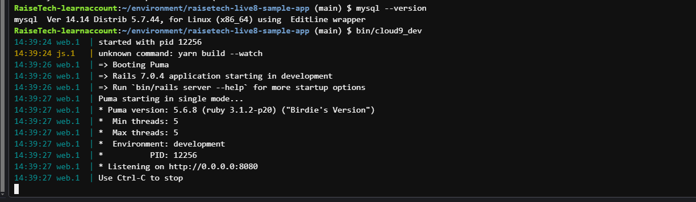
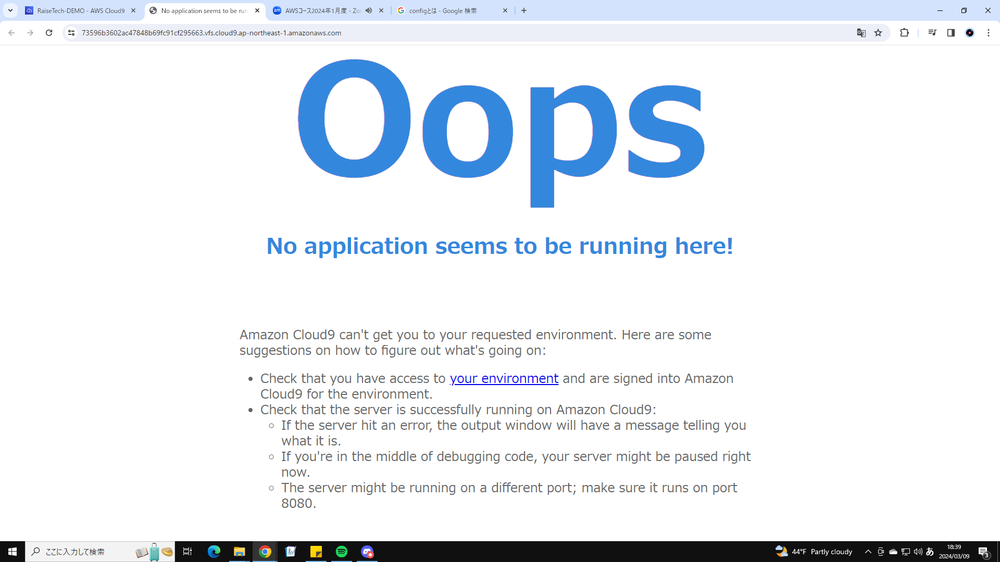
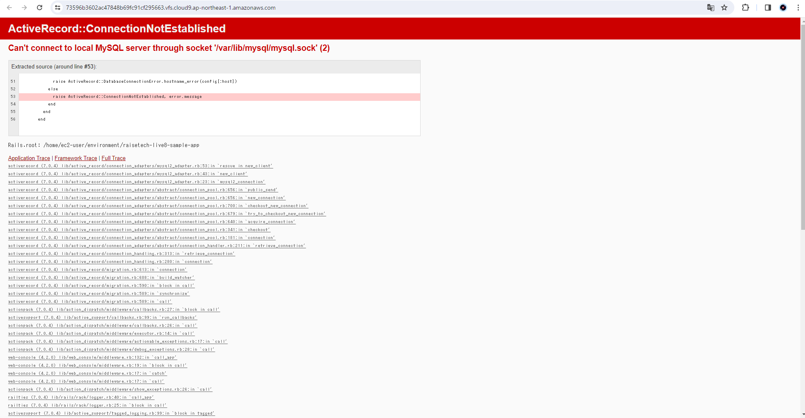
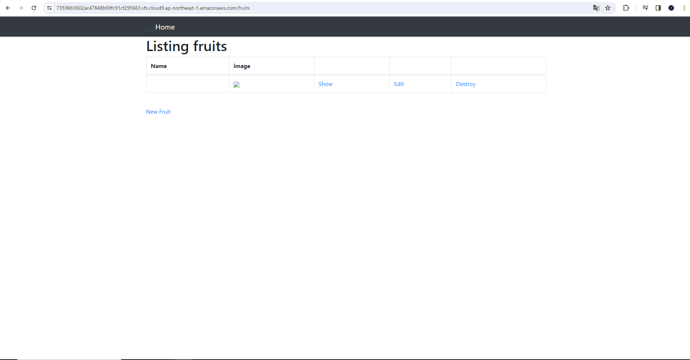

# 第3回課題
## 1. AP サーバーについて調べる。
- AP サーバーの名前とバージョンを確認してみましょう。
  - Puma version: 5.6.8 (ruby 3.1.2-p20)  
  
- AP サーバーを終了させた場合、引き続きアクセスできますか？
  - AP サーバーを終了させた場合、アクセスできなくなる。  
  

## 2. DB サーバーについて調べる。
- サンプルアプリケーションで使った DB サーバー（DB エンジン）の名前と、今 Cloud9 で動作して
いるバージョンはいくつか確認してみましょう。
  - mysql  Ver 14.14 Distirb 5.7.44 for Linux on x86_64  
  
- DB サーバーを終了させた場合、引き続きアクセスできますか？
  - DB サーバーを終了させた場合、アクセスできなくなる。  
  
- Rails の構成管理ツールの名前は何でしたか？
  - Bundler

## 3. Webアプリへアクセス  

## 4. 学んだこと、感じたこと
- 実行するコマンドや確認コマンド等がたくさんあり覚えるのが大変であった。
- MySQLを導入しデプロイしたが、DBserverのエラーがでて解明するのに苦戦した。
  - 結果configのenvironmentにスペースが入っておりうまく起動していなかった。
  - エラーができるということはどこかに原因があると認識し試行錯誤と忍耐力が必要だと感じた.
