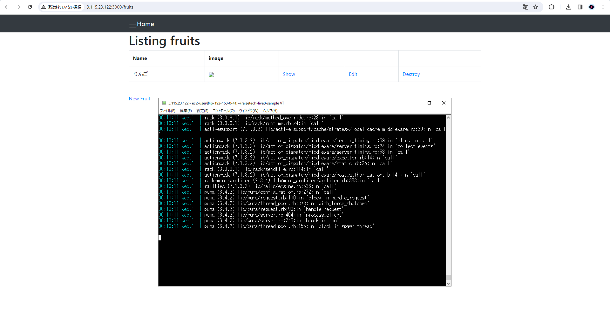
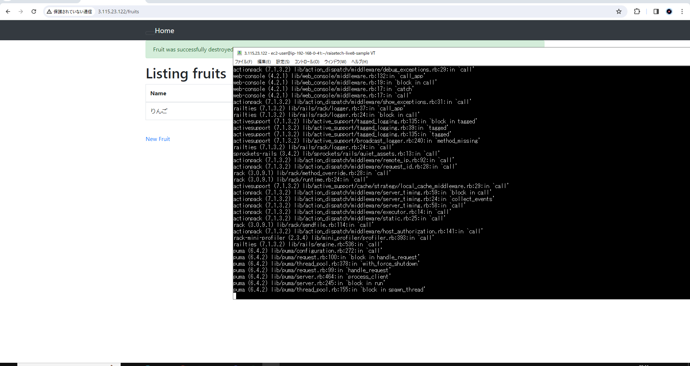
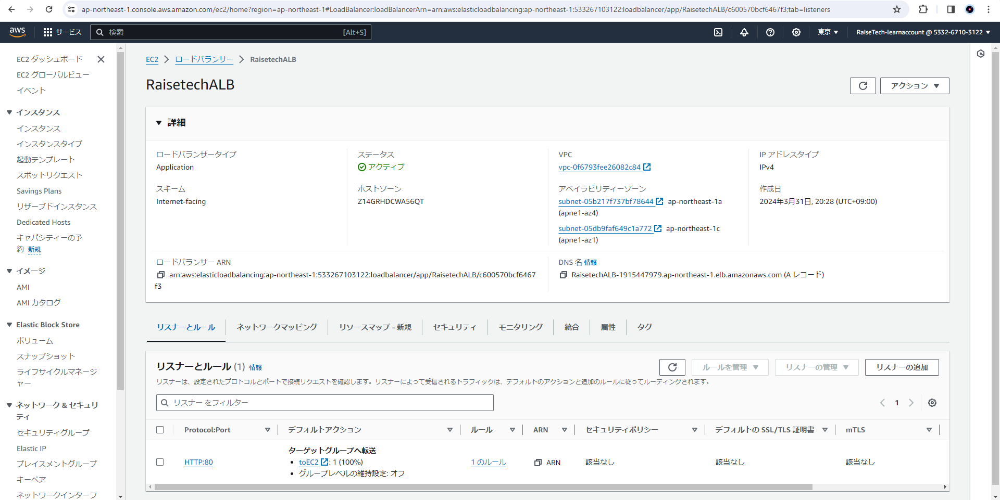
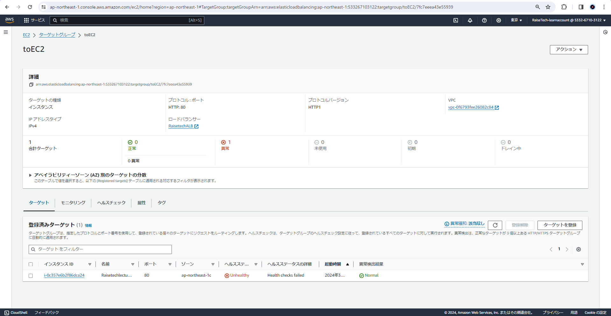
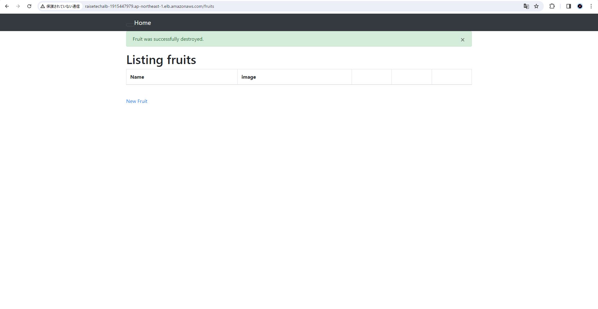
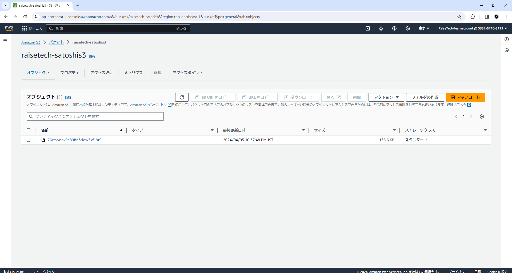
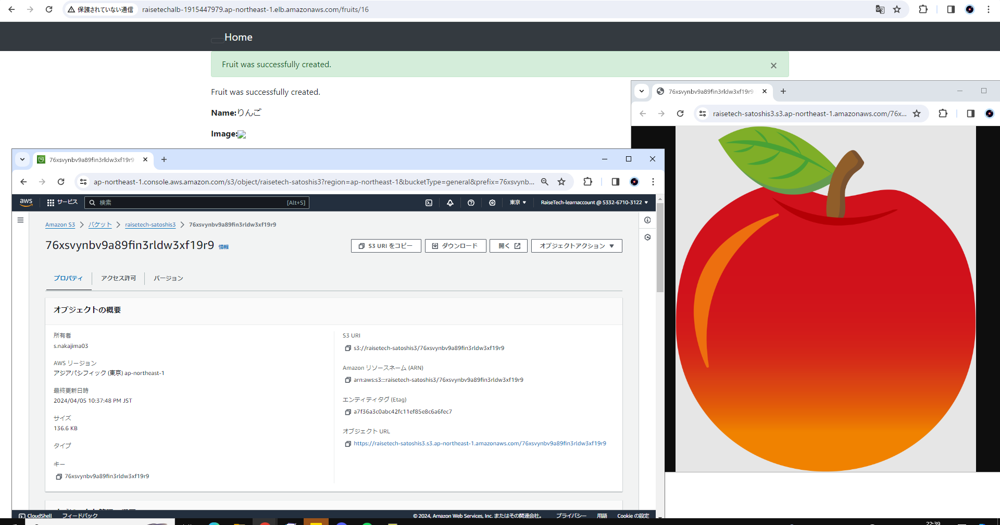
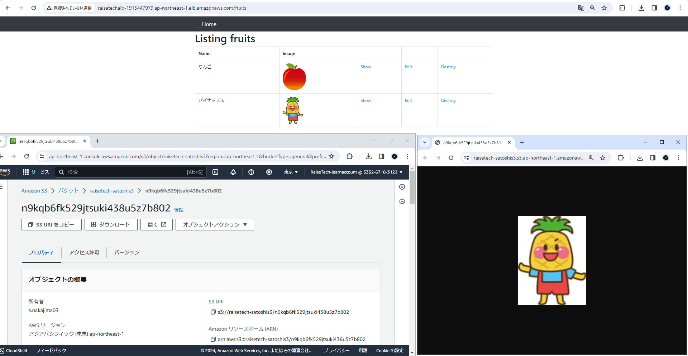
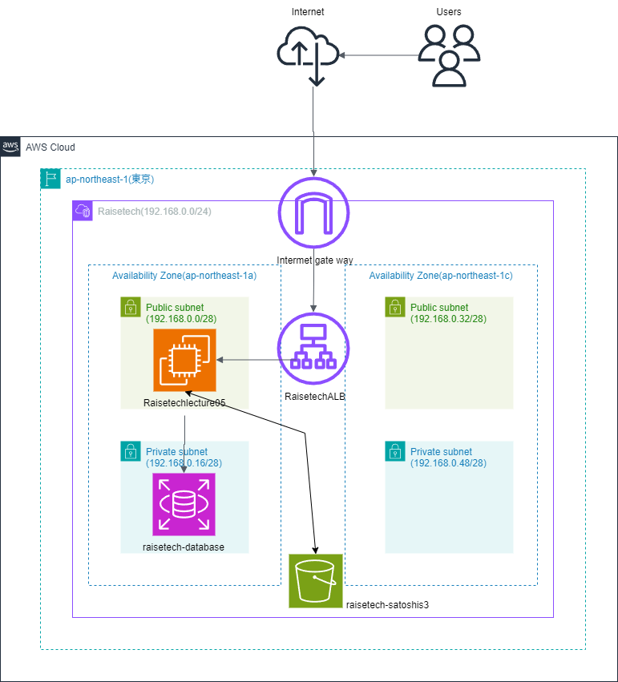
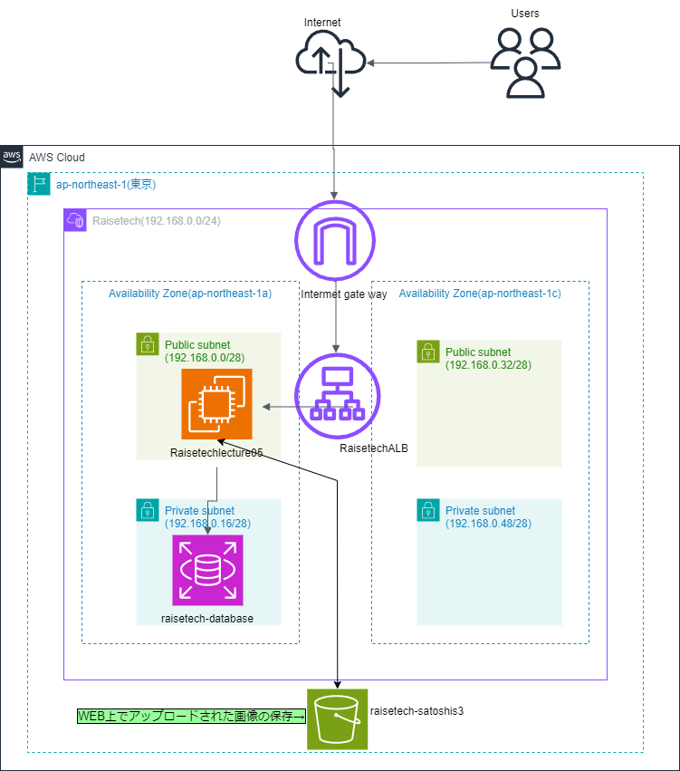

# 第5回課題

## 実施内容

### [サンプルアプリケーション](https://github.com/yuta-ushijima/raisetech-live8-sample-app)のデプロイ結果

- 組み込みサーバーのみ  
    

- サーバーアプリケーションを分離  
      

- ALB追加  
      
      
      

- S3追加  
      

    - S3側で登録された画像を確認  
      
      
    - 修正後 S3側で登録された画像（修正内容：WEB上で正しく画像が表示されているか）  
      

### AWS構成図

- [Draw.io](https://app.diagrams.net/)で作成  
     

- 修正後AWS構成図（修正内容：S3の役割がわかりにくい）
    
  
- 再修正後AWS構成図（修正内容：S3の役割・S3の位置）
    
  
## 所感

- 今回の課題は環境を一から構築するところから始まったため前提知識がなく、ネット等で調べながら課題に着手したため相当時間がかかり苦労した。また、調べたとおりに実行してみてもエラーが発生しそれを解消するのがとても大変であった。
- また、エラーが発生するということはどこかに必ず原因がある！ということを今回学ぶことができた。自分の中で仮説を立て実行し解消されなければ、また仮説を立てるというフレームワークが大切であるなと実感した。
- 課題に着手するなかでまだまだ理解しきれないところがあったので、転職などの自分のゴールを達成したあとに改めて課題にじっくりと取り組みたい。
