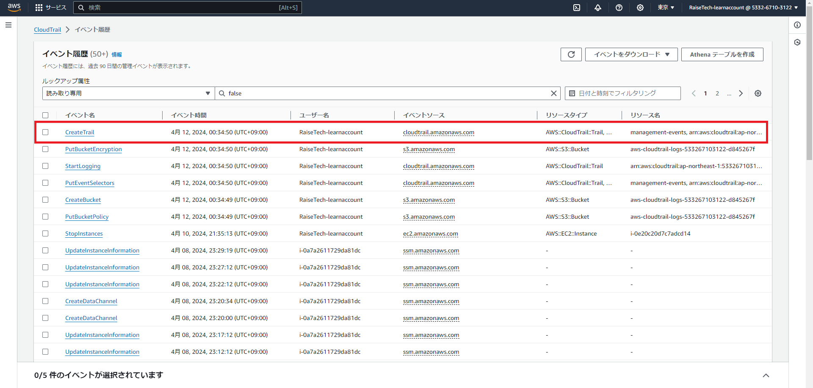
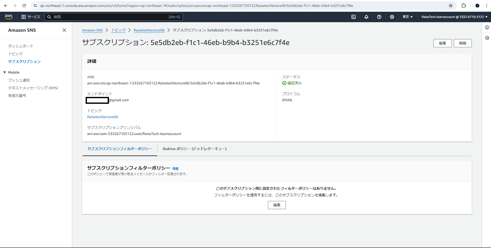
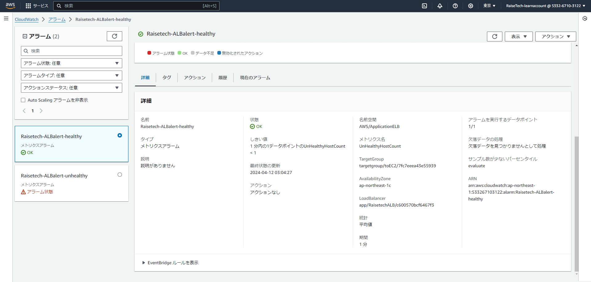
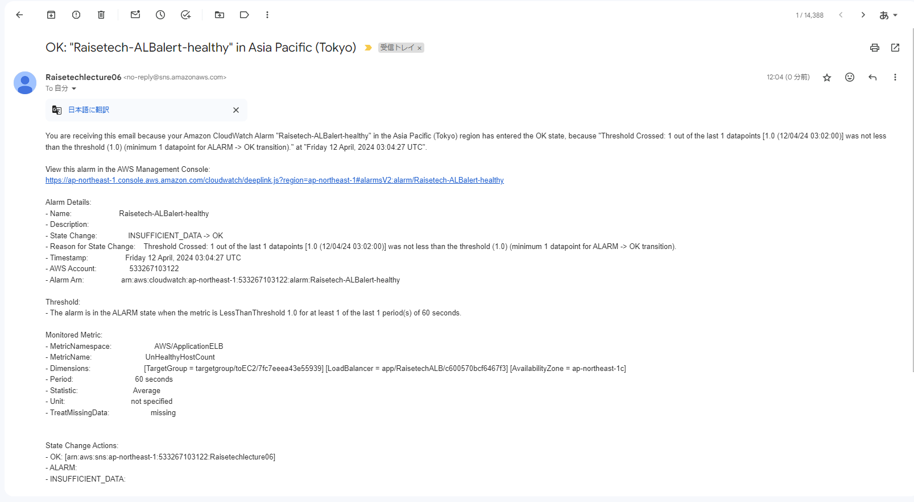
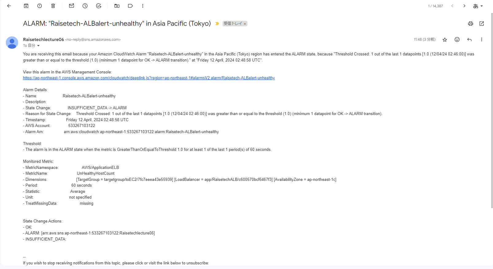
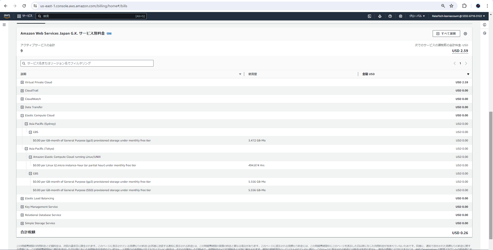

# 第6回課題

---

## 課題内容
- ①CloudTrail のイベントと含まれる内容3点
- ②loudWatchアラームでALBのアラームを設定
- ③AWS利用料の見積
- ④AWS現在の利用料

## CloudTrail のイベント名と含まれる内容3点

- イベント画像
- 
  - イベント名：CreateTrail
  - ユーザー名
  - イベント時間
  - AWSアクセスキー

## CloudWatchアラームでALBのアラームを設定

- AmazonSNSの設定
　

- アラームの設定（アラーム状態とOK状態両方を通知）
　
　

- サンプルアプリケーション起動＆停止（アラーム状態＆OK状態）
  - アラームのメールが届く
  
  

## AWS利用料の見積

[AWS Pricing Calculator](https://calculator.aws/#/estimate?id=72419789b8e12a0d99b5d324b38b8773ce543f0e "AWS Pricing Calculator")

## 現在の利用料（EC2の料金）

EC2の利用料

### 所感

- 現在の利用料を見ることによって、AWSについて右も左もわからない時期にシドニーリージョンにEBSが作成されていたことがわかった。 
このまま気づかなかったら無料利用枠が終了した時点で継続的に金額が発生するところであった。
- 定期的に利用料を確認しコストの最適化を行うことが大切であると実感した。