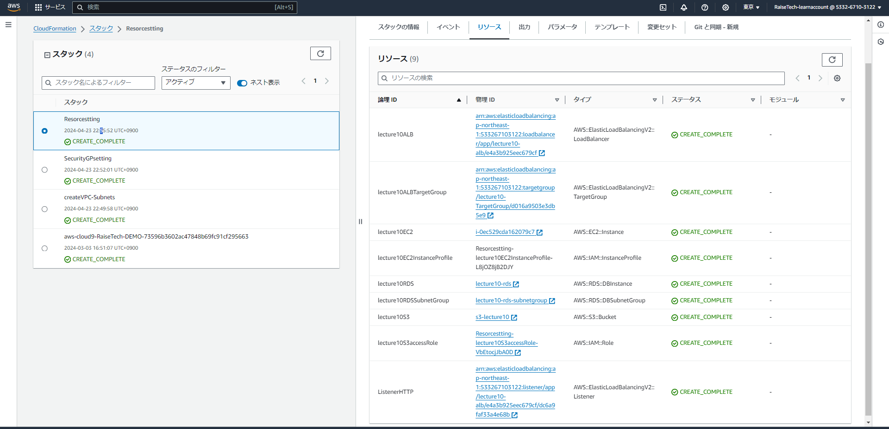

# 第10回課題

## CloudFormationで現在までに作った環境をコード化する。コード化ができたら実行してみて、環境が自動で作られることを確認する
  
- 「CloudFormation」フォルダ内にテンプレートがあります。下記のようにスタックを分割しました。

1. VPC、Subnet、InternetGateway、RouteTable（[VPC.yml](CloudFormation/VPC.yml)）
2. セキュリティグループ設定（[SecurityGP.yml](CloudFormation/SecurityGP.yml)）
3. リソース等（[Resorces.yml](CloudFormation/Resorces.yml)）

---

### CloudFormationで現在までに作った環境をコード化する

- VPC、Subnet、InternetGateway、RouteTable（VPC.yml） 
- セキュリティグループ設定（SecurityGP.yml） 
- リソース等（Resorces.yml） 

---

### TeraTermで接続確認

- 接続確認画面(EC2,RDS,S3)  
 

---

#### 今回の課題で学んだこと、所感

- はじめてyaml形式の記述を行ったが記述方法に気を付けないとエラーになってしまうため丁寧に記述していくことが大切だと実感した。
- CloudFormation利用してリソースをコード化していくことによってマネジメントコンソール画面で構築を行うよりリソースの内部で色々な設定や定義を行っていることを理解することができた。