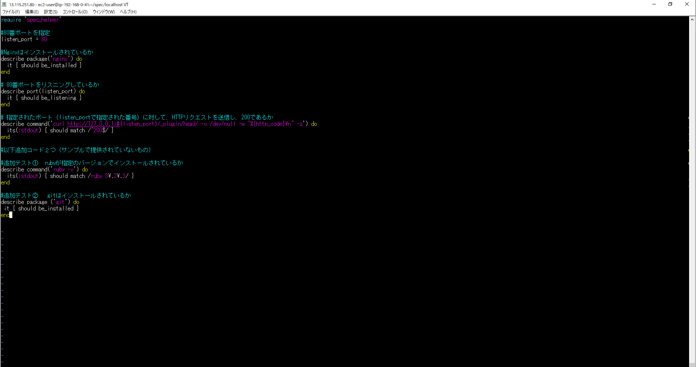
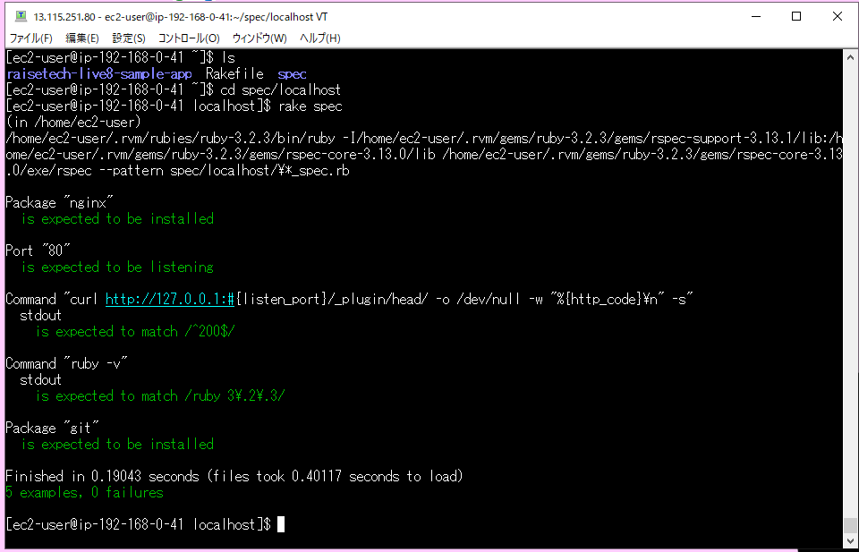

# 第11回課題

- ServerSpec のテストが成功することを追加課題とします。
  - サンプルを提供しますので、授業を参考にカスタマイズしてみてください。
  - テスト定義には決まった答えはないので、自由な発想で色々試してみましょう。
---

## テストのセットアップ

- 課題サンプルからテストの記述をコピーしテストを2つ追加

```bash
# rails_helperの読み込み
require 'spec_helper'

#80番ポートを指定
listen_port = 80

#Nginxがインストールされているか確認
describe package('nginx') do
  it { should be_installed }
end

#指定されたポートをlistenしているか確認
describe port(listen_port) do
  it { should be_listening }
end

#指定されたポート（listen_portで指定された番号）に対して、HTTPリクエストを送信し、200であるか
describe command('curl http://127.0.0.1:#{listen_port}/_plugin/head/ -o /dev/null -w "%{http_code}\n" -s') do
  its(:stdout) { should match /^200$/ }
end

#追加テスト１　rubyが指定のバージョンでインストールされているか確認
describe command('ruby -v') do
  its(:stdout) { should match /ruby 3\.2\.3/ }
end

#追加テスト２　gitがインストールされているか
describe package ('git') do
 it { should be_installed } 
end
```

---

## テストを実行

- テスト成功画面<br>

---

## 今回の課題で学んだこと、所感
- 手動でなにもかも構築するのではなく自動化を行うことで人材の有効活用やコスト削減につながるのだなと実感した。
- ServerSpecのディレクトリを誤った場所に作成しはじめうまくいかなかったため、何を対象としたプログラムなのかを明確にして取り組むことが重要だと感じた。