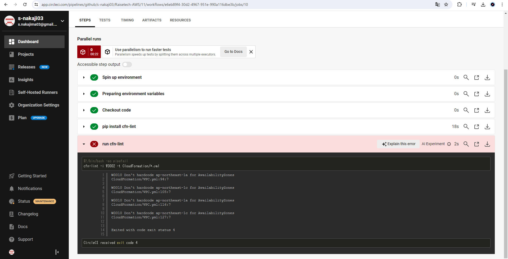
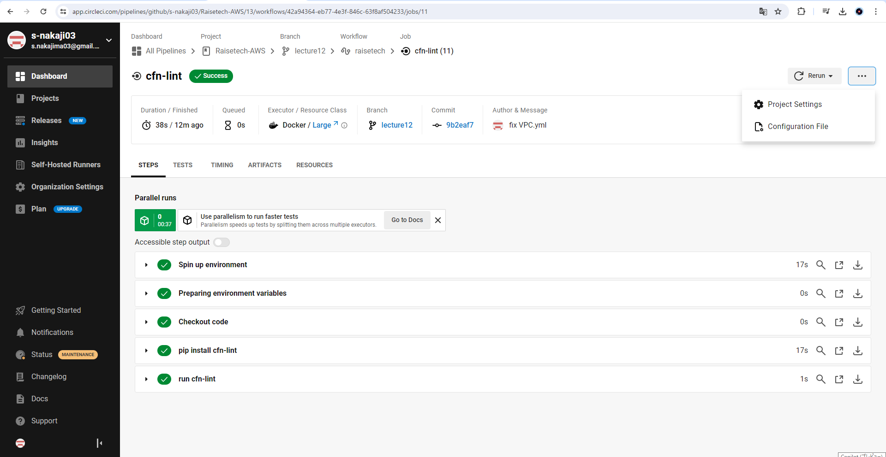

# 第12回課題

- 課題：CircleCI のサンプルコンフィグを提供しますので、これが正しく動作するようにリポジトリに組み込んでください。

```bash
#サンプルコンフィグ（「CloudFormation」ディレクトリ内の*.ymlファイルをcfn-lintでチェック）

#CircleCIのバージョンを指定
version: 2.1
orbs:
  python: circleci/python@2.0.3
jobs:
  cfn-lint:
    executor: python/default
    steps:
      - checkout
      - run: pip install cfn-lint
      - run:
          name: run cfn-lint
          command: |
            cfn-lint -i W3002 -t CloudFormation/*.yml #自分のディレクトリ名に一部変更

#実行順序を規定
workflows:
  raisetech:
    jobs:
      - cfn-lint
```

---

## CircleCIでプロジェクトを作成しテストを実行

1. エラーが検出<br>
　　→サブネットのAZがハードコードという指摘でエラーが発生。テンプレートの記述方法を修正。<br>
2. エラーの解消<br>

---


### 今回の課題で学んだこと、所感

- cloudformationのテンプレートに適切でないコードがあると自動で検出し修正するようにエラー出してくれ、バグの検出と修正が容易になることがわかった。
